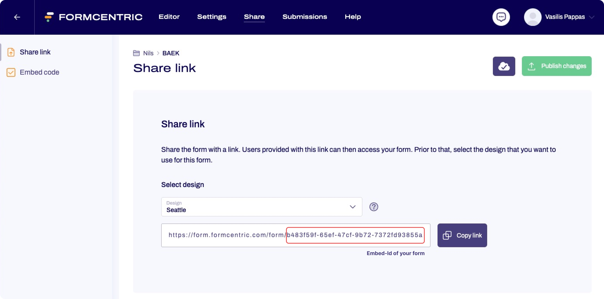

# Formcentric Theme Customization Workspace

### Create custom themes based on official Formcentric themes

## Table of Contents
1. [Installation](#installation)
2. [Usage](#usage)
3. [Creating a custom theme](#creating-a-custom-theme)
4. [Customization](#customization)
5. [Reset workspace](#reset-workspace)

---
## Installation

```bash
pnpm i
```

## Usage for FC Cloud users
```bash
pnpm dev-cloud
```
#### Changing forms
You can change the preview form by using the dropdown in the sidebar. If you need to test your design with your custom form you can by adjusting the ```./config/cloudConfig.json``` file. The ```fcForms``` array determines which forms will be rendered in the sidebar dropdown. Add new objects for your own forms or remove existing ones.

```
{
    "id":  "<form-embed-id>", // see the screenshot below 
    "name": "Contact form" // this is used by the dropdown as a display name
},        
```




## Usage for self-hosted users:
1. Check if the URL of your headless-server matches the predefined URL in ```./config/localConfig.json``` (http://localhost:8080) and adjust it if needed.

2. Start the development server using

    ```bash
    pnpm dev-local
    ```
3. Set your form definition either in ```./config/localConfig.json``` or paste it inside the input field of our user interface (located in the sidebar below the *Formcentric* logo). <br>**NOTE:** If you decide to use the input the definition will only be saved in the apps localStorage. To permanently use the form definition adjust the **fcFormDefinition** property of the localConfig.json file.

## Creating a custom theme
Create a custom theme using the command below. The first argument is required and specifies the name of the official theme you want to customize and the second optional argument specifies the name (which is also the foldername) of your custom theme. 


The script will copy an existing fc-theme into your ```src/themes``` folder. It will show up in the sidebar under custom themes.

```
    pnpm create-theme [official-theme-name] [custom-theme-name]
```

## Customization
You have full control over custom themes created with the fc-create-theme command. The server automatically refreshes when making changes to scss, js files or the _variables.json file. When adding new fonts or images you have to manually start a build with ```pnpm build```.

There are three main ways to customize a theme:

### CSS Variables
One of the best ways to start customizing is to tweak the css variables located in ```_variables.json```. 

**NOTE:** <br>
To view the changes on the develpment server it is sufficient to make changes to the file mentioned above. If your target environment is CoreMedia it is necessary to adjust the variables in ```_variables.scss``` as well.

### SCSS Partials
When you need to make more specific style changes you have to adjust the scss files located in ```/partials```. Change existing partial files or add your own. When you decide to add a partial you have to import it in the ```styles.scss``` (root folder).

### JavaScript Templates
The HTML Markup is writting in JavaScript Templates inside the ```/templates``` folder. 
Templates are basic functions which return HTML. They are called by the formapp and receive specific props which differ depending on the form element. A complete list of props will be available in our upcoming documentation.

To change the markup of a form field find its template file and edit the HTML output.

## Reset workspace
To reset the whole workspace you can run. After a confirmation the script will reinstall node_modules and remove all files which were copied or created on dev-server startup. Make sure you have no uncommited changes in your theme directory. 
```
pnpm reset
```

