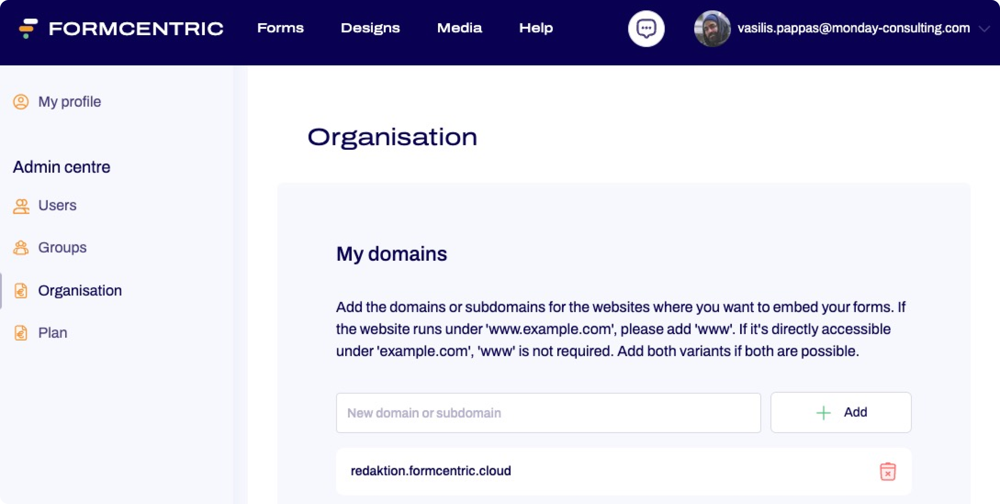

# Formcentric theme-customization-workspace
### Create custom themes based on official formcentric themes

## Table of Contents
- [Formcentric theme-customization-workspace](#formcentric-theme-customization-workspace)
    - [Create custom themes based on official formcentric themes](#create-custom-themes-based-on-official-formcentric-themes)
  - [Table of Contents](#table-of-contents)
  - [Installation](#installation)
  - [Usage](#usage)
  - [Form Configuration](#form-configuration)
    - [For Formcentric cloud users:](#for-formcentric-cloud-users)
    - [For users with a self-hosted headless server:](#for-users-with-a-self-hosted-headless-server)
  - [Creating a custom theme](#creating-a-custom-theme)
  - [Customization](#customization)

## Installation

```bash
pnpm i
```

## Usage
```bash
pnpm dev
```

The official formcentric themes will be copied to ```src/fc-themes``` when starting the development server. Use the sidebar to switch between themes and find one that you want to use for your custom theme.

## Form Configuration
The configuration for rendering a *Formcentric* form is located in ```./config/formcentricConfig.json```. Using the default config will render an example form. If you want to use your own form you need to adjust the config file:

Default configuration:
```
{
    "fcCloud": true,
    "fcEmbedId": "a40a1000-3f23-4e1e-9bb2-82487ecc1d9a",
    "fcUrl": "https://form.formcentric.com/headless-server/",
    "fcProxyDomain": "formcentric.com",
    "devServerPort":1234
}
```
<br>

### For Formcentric cloud users:
- Set **fcEmbedId** to the embed Id of your form
<br>
<br>


<br>

- Set **fcProxyDomain** to a domain you added here https://editor.formcentric.com/settings/tenant
<br>
<br>

<br>
<br>

### For users with a self-hosted headless server:
- Set **fcCloud** to false
- Set **fcEmbedId** to the embed Id of your form
- Set **fcUrl** to the url of your self-hosted headless-server
- **fcProxyDomain** can be left as is or removed; will be ignored for self-hosted users 

<br>

**Example config:**

```
{
    "fcCloud": false,
    "fcEmbedId": <form-embed-id>,
    "fcUrl": <your-headless-server-url>,
    "devServerPort":1234
}
```

## Creating a custom theme
Run this command to create a custom theme. The first argument specifies the name of the official theme you want to customize and the second argument specifies the name (which is also the foldername) of your custom theme. 

The script will copy an existing fc-theme into your ```src/themes``` folder. It will show up in the sidebar under custom themes.

```
    pnpm fc-create-theme [fc-theme-name] [custom-theme-name]
```

## Customization
- Tweak the theme by changing properties in _variables.json 
- To edit the css you can change the scss partials located in ```src/themes/[themeName]/partials``` 
- To edit the html markup you can change the js template files located in ```src/themes/[themeName]/templates```
